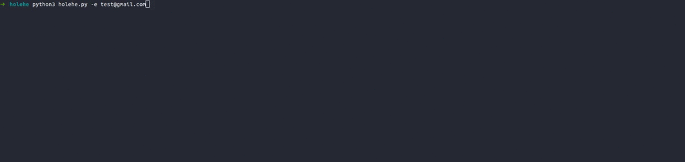

# Holehe
# Educational purposes only
### If you have any suggestions, please do not hesitate to contact us. 
holehe allows you to check if the mail is used on different sites like twitter, instagram and will retrieve information on sites with the forgotten password function.

[](https://www.python.org/)
## Project example : [Holehe Maltego](https://github.com/megadose/holehe-maltego)
### Demo

## 💡 Prerequisite
   [Python 2/3](https://www.python.org/downloads/release/python-370/)
## 🛠️ Installation
### With PyPI
```pip3 install holehe```
### With Github
```bash
git clone https://github.com/megadose/holehe.git
cd holehe/
python3 setup.py install
```
## 📚 Example
```bash
python3 holehe.py -e test@gmail.com
```
## 📈 Usage
```python
from holehe import *
print(adobe("test@gmail.com"))
print(apple("test@gmail.com"))
```
## Lists of modules:
- adobe
- ebay
- apple
- facebook
- instagram
- tumblr
- pastebin
- github
- twitter
- pinterest
- lastfm
- spotify
- firefox

## The output of the modules
The result of the modules is in this form : `` {"rateLimit":False,"exists":True,"emailrecovery":ex****e@gmail.com,"phoneNumber":'0************78","others":None}``
- rateLitmit : is to find out if you've been rate-limited
- exists : know an account is associated with the mail
- emailrecovery : it's a partial mail that can potentially be extracted from the mail entered on the module.
- phoneNumber : it's a partial phone number that can potentially be extracted from the mail entered on the module.
- others : is used for all information other for the moment it is only useful for facebook {"FullName":full_name,"profilePicture":profile_picture} FullName has a lot of false positives, and profilePicture is the url of the profile picture associated with the account.

## Rate limit, just change your IP
## Thank you to :
- [Chris](https://twitter.com/chris_kirsch)
- [socialscan](https://pypi.org/project/socialscan/)
## 📝 License
[GNU General Public License v3.0](https://www.gnu.org/licenses/gpl-3.0.fr.html)
